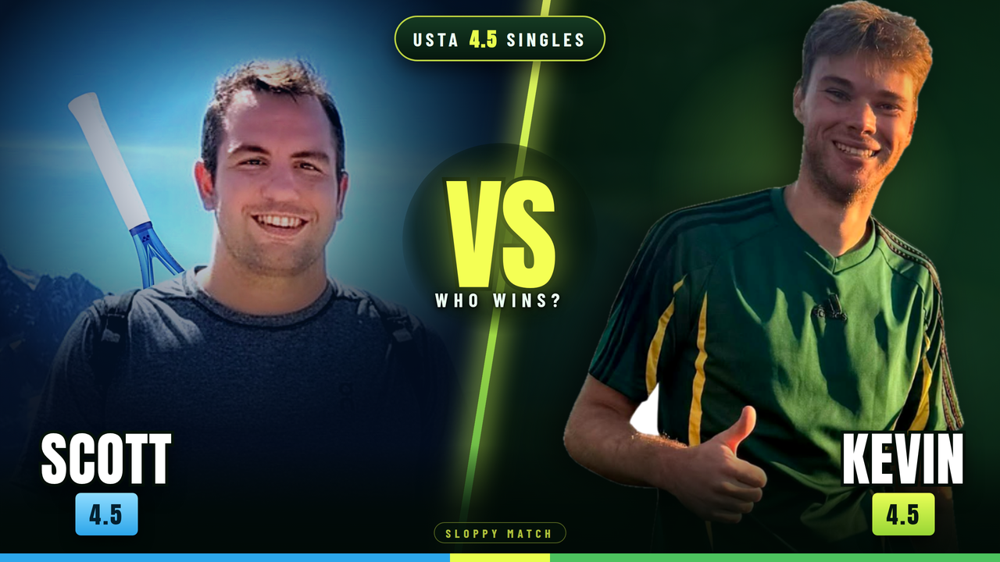

# YouTube cover — Scott vs Kevin (USTA 4.5 singles)



## Files

| File | Use |
| --- | --- |
| `cover-scott-vs-kevin.png` | **Upload this one.** 1280×720, YouTube's recommended thumbnail size |
| `cover-scott-vs-kevin@2x.png` | 2560×1440 master, for reuse in a video intro or end card |
| `cover-scott-vs-kevin.jpg` | ~145 KB JPEG, if you want the smallest upload |
| `cover-scott-vs-kevin-full-match.png` | Same art with `FULL MATCH` instead of `WHO WINS?` |

## Design

- Background is the real match court (`IMG_8524.jpg`), blurred and darkened so the faces carry the frame.
- Diagonal split with a tennis-ball-yellow seam: Scott cool/blue on the left, Kevin warm/green on the right.
- Both faces are sized to match, kept in the upper two thirds and out of the corner where YouTube stamps the duration.
- Text is limited to `VS`, a short hook, and the two names + `4.5` badges so it stays readable at sidebar size.

## Regenerating

```sh
npm install @fontsource/anton @fontsource/barlow-condensed   # display fonts
python3 -m pip install pillow
python3 prep_assets.py            # rebuilds assets/ from ../tennis ball pics
python3 make_cover.py             # -> cover-scott-vs-kevin.png (+ @2x, .jpg)
python3 make_cover.py "FULL MATCH" cover-scott-vs-kevin-full-match
```

`make_cover.py` takes the sub-headline as its first argument and the output
basename as its second, so new variants are one command. Renders through
headless Chromium; set `CHROME=/path/to/chrome` if it can't find a browser.

`assets/` is committed so `make_cover.py` runs on its own:

- `kevin_cut.png` — Kevin with his white backdrop flood-filled out (reusable for other thumbnails)
- `kevin_top.png` — the head-to-thumbs-up crop used on the cover
- `scott.jpg` — Scott's crop, sharpened and graded
- `bg.jpg` — the court photo, 16:9, blurred and darkened
